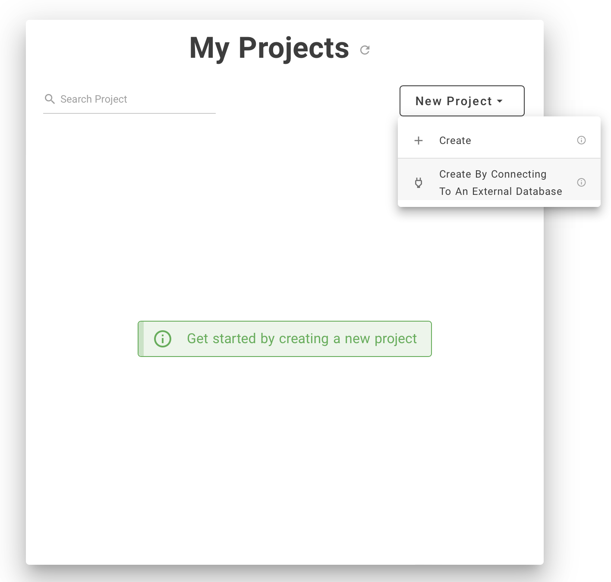
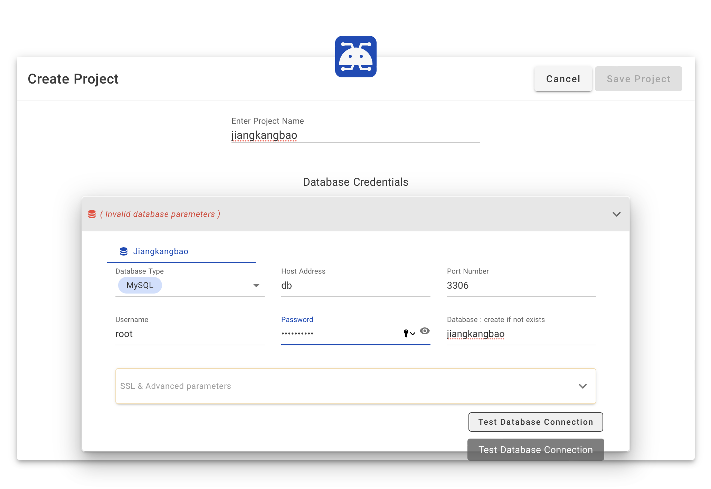
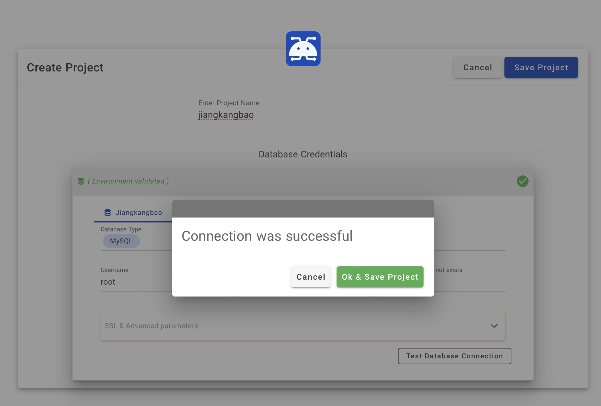
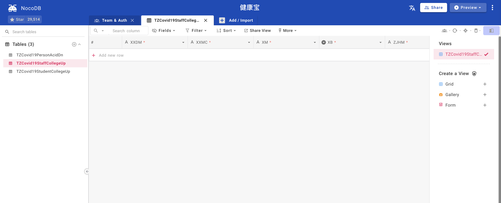
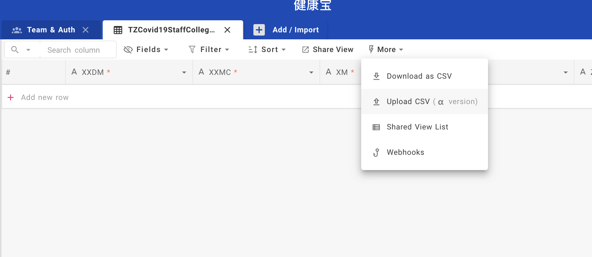

# 北京健康宝数据对接前置数据库部署

本项目提供自动初始化的数据库和一站简单的数据管理工具，数据库初始化完成后，监听本机3306端口，数据管理工具除提供管理界面外，还支持API读写数据表，便于与其它系统直接集成。

## 环境准备
在 CentOS 或 Debian 系统的服务器上，执行 install_docker.sh 安装docker运行环境和docker-compose

## 启动
用以下命令运行数据库，将自动初始化数据库结构，并提供一个简单的数据管理工具
```shell
docker-compose up -d
```

大约30秒后，可在 http://localhost 访问到管理界面

## 管理界面

### 语言切换
点击页面右上角的【文】字图标，可切换界面语言

### 登录密码
登录用户名 ```admin@fenglu.vip``` 密码 ```13yws@WvnX```，第一次运行前可在docker-compose.yml文件中修改，或启动后在系统内修改。

### 连接数据库
在登录后的界面中，按提示新建数据库连接，主机地址填 db，密码为 ```vjio2fZsfe```（同样在第一次运行前可在docker-compose.yml内修改），数据库名为 jiankangbao，然后测试数据库连接，测试成功后保存。

（最上方的项目名称也可在这里修改）








### 管理数据
创建完项目后，即进入数据管理界面，这里可以查看或修改已有数据（现在还没有），也可以使用CSV文件导入数据。



### 导入数据

打开数据表后，在页面顶部Tab下方的工具栏中，点击More可以看到上传CSV的菜单，可以直接导入数据，注意CSV字段顺序必须与数据库内一致，空字段也要保留足够的逗号，一般可以Excel内编辑好后，导出为CSV。


